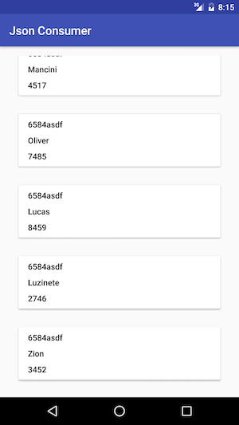

# Android-json-consumer
Aplicativo Android para ler dados de um json (online) e exibir em uma lista

### Bibliotecas utilizadas
##### Nativas
* [AppCompat] - com.android.support:appcompat-v7:24.2.0
* [Design] - com.android.support:design:24.2.0
* [ReciclerView] - com.android.support:recyclerview-v7:24.2.0
* [CardView] - com.android.support:cardview-v7:24.2.0

##### De terceiros
* [Retrofit] - com.squareup.retrofit2:retrofit:2.1.0
* [Retrofit-Converter-Gson] - com.squareup.retrofit2:converter-gson:2.1.0

---
[AppCompat]:https://developer.android.com/tools/support-library/features.html
[Design]:http://android-developers.blogspot.com.br/2015/05/android-design-support-library.html
[ReciclerView]:https://developer.android.com/training/material/lists-cards.html
[CardView]:http://developer.android.com/intl/pt-br/training/material/lists-cards.html
[Retrofit]:http://square.github.io/retrofit
[Retrofit-Converter-Gson]:https://github.com/google/gson
